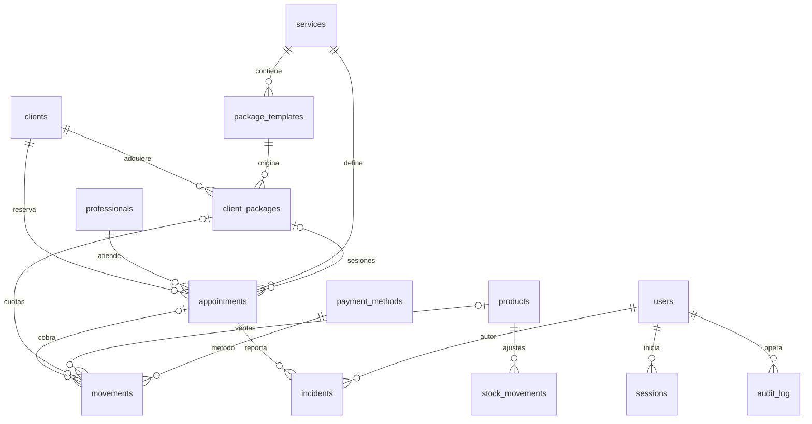

# Relevamiento funcional y visual

Fuente: `https://spa.cieloytierra.com.py/dashboard`, sesión «Prof. Avanzado», 19/09/2026. Se distingue aquí la observación de la reconstrucción propuesta.

## Navegación y diseño común

Menú: Inicio, Agenda, Clientes, Caja, Inventario, Paquetes y Reportes. En el pie del menú aparecen perfil, email, cambiar contraseña y cerrar sesión. Encabezado con apertura de menú, email truncado y cambio de tema. La barra lateral observada tiene 240 px; se oculta bajo el breakpoint `lg` (1024 px) y se usa como panel móvil. El área principal usa 16/24/32 px según ancho. Tipografía Arial, Helvetica, sans-serif.

Tokens y medidas medidos:

| Componente | Observación |
| --- | --- |
| Texto oscuro | `#e8e4ed` |
| Barra lateral oscura | `#161420` |
| Navegación activa oscura | fondo `#2a1f38`, texto `#c4a8dc` |
| Acento/botón oscuro | `#a67fd4` |
| Título | 24 px en escritorio intermedio, peso 700 |
| Navegación | 14 px, relleno 10 × 12 px, radio 12 px |
| Inputs | 14 px, relleno 10 × 14 px, radio 12 px |
| Botón principal | 14 px, peso 600, relleno 10 × 20 px, radio 12 px |
| Tarjetas | radio 16 px, borde y sombra; KPI con degradados |
| Cabecera de tabla | 12 px, mayúsculas, peso 600, relleno 14 × 20 px |
| Celda de tabla | 14 px, relleno 16 × 20 px |
| Damas | etiqueta rosa/fucsia `#D946EF` |
| Caballero | etiqueta verde `#10B981` |
| Faciales | etiqueta azul `#3B82F6` |

`public/assets/original.css` conserva las variables, utilidades, estados de interacción, reglas claras/oscuras y tamaños reales. No se reemplaza por una paleta deducida de una imagen.

## Inicio

Saludo «Buenos días», email, cuatro tarjetas: citas hoy, saldo en caja, clientes activos y profesionales. Valores observados: 0, Gs. 20.046.362, 336 y 4. KPI en morado, verde, azul y ámbar. Dos columnas en la captura original de 948 px. Los contadores de la réplica provienen de la base local, no de números fijados en HTML.

## Agenda

Rutas y variantes: `/dashboard/agenda`, parámetros `vista=dia|semana|lista`, `fecha=AAAA-MM-DD`, `modo=dia`, `mes=anterior`.

- Día: selector de fecha, anterior/siguiente, enlace Hoy; rejilla de horas y profesionales. Solo aparecen profesionales con citas en el día observado.
- Semana: siete columnas, cabecera con día, fecha y cantidad; hasta cuatro citas y enlace «+N más» por día.
- Lista: Por día, Este mes y Mes anterior; agrupación por fecha y cantidad.
- Cita: hora, estado, cliente, tratamiento, tipo, profesional, precio, métodos de pago y acciones según estado.
- Acciones vistas: confirmar, cancelar, incidencia, eliminar, reprogramar y recordatorio por WhatsApp. Clientes sin teléfono muestran un control deshabilitado con explicación.
- Citas completadas conservan incidencia y contacto; pendientes muestran además cambios de estado, eliminación y reprogramación.

Alta común:

| Campo | Control observado |
| --- | --- |
| Cliente | búsqueda por nombre, teléfono o RUC |
| Profesional | selector de cuatro profesionales |
| Tipo Servicio | Caballero, Damas, Faciales |
| Tratamiento | búsqueda dependiente del tipo; deshabilitada inicialmente |
| Fecha | fecha seleccionada de la agenda |
| Hora | botones cada 30 minutos de 08:00 a 20:00, ambos incluidos |
| Guardar | Confirmar cita |

Pestaña «Sesión de paquete»: estado vacío «No hay clientes con paquetes activos disponibles». Reprogramación: fecha, la misma grilla horaria, Cancelar y Reprogramar. Incidencia: texto «Describí el problema para que un encargado lo revise», descripción obligatoria, Cancelar y Reportar.

## Clientes

Tabla: Nombre, RUC, Teléfono, Email y Acciones. Botones Editar/Eliminar por fila; búsqueda por nombre, teléfono o RUC; 50 filas por página y 7 páginas para 336 clientes. Se conservaron duplicados de nombre tal como se observaron.

Formulario: Nombre obligatorio; RUC con ayuda «Formato: número o número-dígito verificador (ej: 1234567-8)»; Teléfono; Email; Fecha de nacimiento; Notas. Alta con «Crear cliente».

Modelo reconstruido: `clients`, con `id`, campos anteriores, `active` y fecha de creación. Los campos opcionales no observados en cada ficha permanecen nulos.

## Caja

Ruta `/dashboard/caja`, variantes `fecha`, `tab=mensual` y `mes`.

Diaria: Ingresos del día, Egresos del día, Balance del día; Ingreso efectivo hoy, Egreso efectivo hoy y Balance efectivo hoy. Tabla Tipo, Concepto, Método, Bruto, Real y Saldo. El saldo por fila arrastra movimientos anteriores. La apertura del mes contiene saldo anterior y desglose de efectivo/banco en el concepto.

Mensual: tres KPI del período; ingresos por método (Método, Cantidad, Total); por tipo (Tipo, Cantidad, Total); totales por día (Día, Ingresos, Egresos, Balance), con enlaces al detalle diario. Los totales observados están en README.

«Nuevo movimiento» contiene tres pestañas:

1. Ingreso / Egreso: fecha obligatoria; tipo; método; monto; descripción opcional; Registrar.
2. Venta producto: fecha, producto con stock disponible, cantidad, precio unitario, método, cliente opcional y profesional opcional para comisión; Registrar venta.
3. Paquetes: subpestañas Vender paquete nuevo / Pagar cuota existente.

Métodos observados: Efectivo, Tarjeta Débito, Tarjeta de Crédito, Transferencia, Voucher. La diferencia Bruto/Real es relevante: ejemplos observados 140.000 → 136.920 en débito y 300.000 → 290.100 en crédito. Otros ingresos con tarjeta no tenían descuento; la condición de excepción permanece desconocida.

Venta de paquete: paquete obligatorio, cliente obligatorio, casilla «El cliente ya abonó (registrar como pagado sin impactar caja)», fecha, método, monto del primer pago con 0 permitido y notas. Cuota: fecha, paquete del cliente pendiente, método y monto.

Modelos reconstruidos: `movements`, `payment_methods`, `stock_movements`, `client_packages`, `package_templates`. Venta de producto y stock se guardan en la misma transacción. Cuotas bloquean el registro antes de actualizar saldo.

## Inventario

Tabla Producto, Tipo, Stock, Mínimo, Precio unit., Comisión, Ajustar y Acciones. Ajustes «−»/«+» y edición. Alerta de mínimos: 3 productos, Almohaditas, AntiFaz y Tonico.

Edición: Nombre obligatorio, Tipo (ejemplo «cremas, aceites, toallas...»), Stock actual, Stock mínimo, Precio unitario en Gs., Comisión por venta en %. Guardar cambios. No se observó botón de alta de productos para este perfil.

Valores copiados: 9 productos; Gel de Limpieza con stock 3; los demás con stock 0. Precios visibles Almohaditas 80.000, AntiFaz 50.000 y Tonico 150.000; Tonico con comisión 10%. Los demás precios visibles eran 0.

## Paquetes

Título «Paquetes vendidos», subtítulo «Gestión de paquetes de tratamientos de clientes». Filtros: Todos, Pend. pago, Pago parcial, Pagado, En curso, Completado y Cancelado. Tabla Cliente, Paquete, Sesiones, Pagado, Total y Estado. No había registros.

Modelo propuesto: plantilla con servicio, sesiones y total; paquete vendido con cliente, importe total/pagado, sesiones totales/usadas y cancelación. Este diseño permite las acciones visibles de caja y agenda, pero no prueba la estructura interna original. Detalles/vencimientos/paquetes de servicios múltiples requieren evidencia adicional.

## Reportes

Pestaña Resumen; título Reportes y período con «Gestión global». Exportar PDF/Excel. Filtros Mes actual, Mes anterior, Esta semana, Semana pasada, desde/hasta y Filtrar.

KPI observados: 115 citas y Gs. 8.295.000 de comisiones generales. Profesionales: Lenny Aguiar, 44 citas/Gs. 2.300.000; Tamara Rojas, 39/Gs. 2.370.000; Laura Ortiz, 32/Gs. 3.625.000. Tabla de ocho servicios más realizados: Servicio, Tipo, Cantidad y Comisiones generales. Datos exactos preservados en `reference/observed.json`, propiedad `report`.

La reconstrucción calcula reportes sobre citas completadas. Si faltan comisiones individuales muestra pendiente de verificar y no prorratea automáticamente los totales originales.

## Relaciones de los modelos reconstruidos

Las relaciones originales no visibles se mantienen sin asignación al importar, en lugar de adjudicar IDs a partir de coincidencias ambiguas de nombres.
